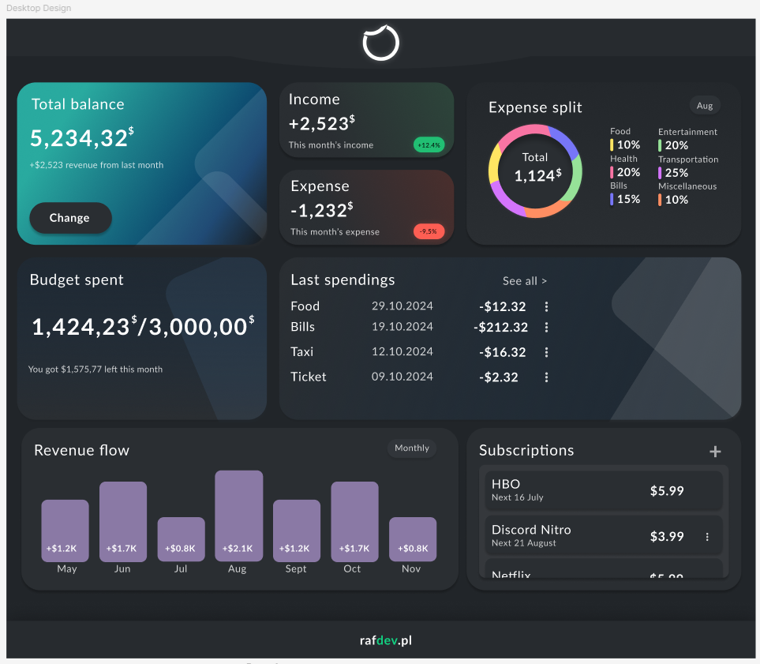

# MyWealth - financial management web application

**_MyWealth is a financial management web application designed to help users track and manage their personal finances efficiently._**

Each user has their own database structure. User can add, edit or delete transaction or subscriptions. Everything refresh in realtime.
It was my second time using firebase. This time it was more complex since 90% of this website is working of it.

Link to [website](https://ludzikk.github.io/MyWealth/), it was built using [GitHub Pages](https://pages.github.com/).

**Account for testing**

E-mail: test@gmail.com
Password: Test123

**What i used in this project:**

1. HTML
2. SCCS
3. JS
4. Firebase

**I used icons from:**

1. [fontawesome](https://fontawesome.com)

## Figma desing

This was my first time using figma and creating design by my own.

